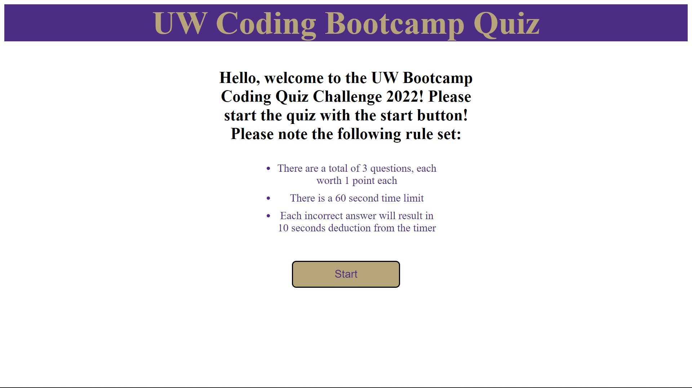

# <coding-quiz>

## Description

The premise of this project was to create an interactive coding quiz. The project had a heavy emphasis on Javascript with the demonstration of functions, arrays, and eventListeners, local storage.

Provide a short description explaining the what, why, and how of your project. Use the following questions as a guide:

- What was your motivation?
- Why did you build this project? (Note: the answer is not "Because it was a homework assignment.")
- What problem does it solve?
- What did you learn?

## Installation

This is a project that is available online via weblink. 

- https://samlee088.github.io/quiz/

Additionally, the back-end coding is available for download through github.

- https://github.com/samlee088/quiz

## Usage

The quiz will initiate with the ‘start’ button located in the introduction. The quiz will end once either the user answers all of the available questions, or once the timer reaches 0. Once the user reaches the end of the quiz, they will be required to input text to submit in a score. The scores are stored locally, however there is a ‘reset’ action button to restore the list to a blank list.

## Credits

NA

## License

NA

---
